# Initial Set Up - Check Before You Start!

Do you have a GitHub account? If not sign up here: https://github.com/

Have you logged into Guacamole?
Log in via the IP: http://54.171.164.67/#/
You will need your username and password from: <LINK>

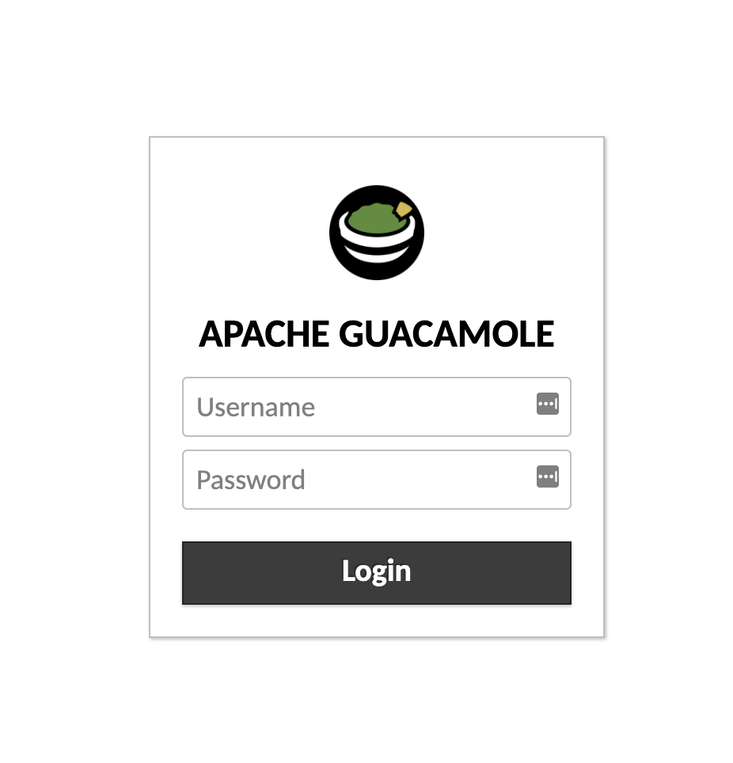

Then select `VNC-1`

When it is opened you should see `VSCode` on the `Desktop`. Double click it to open. There is also a web browser that you can open here: 

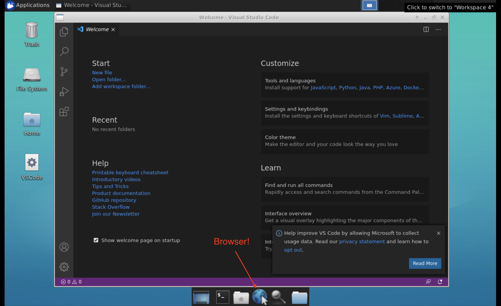

Log into your GitHub account inside of the Guacamole instance browser (firefox): https://github.com

---

Running Cypress with record from your local machine

`cypress run --record --key <record key>`

--OR--

`export CYPRESS_RECORD_KEY=<record key>`
`cypress run --record`

> TIP: Store your <record key> in your .env file, ADD: .env to .gitignore file


# Stage 1: Getting Started with Cypress Dashboard

Go to https://dashboard.cypress.io/login and make an account! 

> TIP: you can just use your GitHub account to log in!

Once it is all linked up you should see this screen. 

 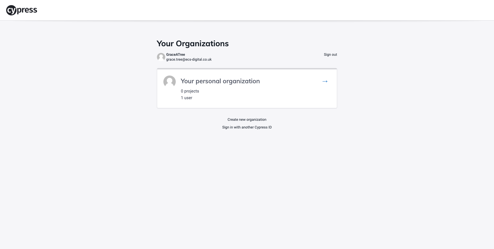

You will need to fork this repository into your own GitHub account by clicking the ‘Fork’ button in the top right: https://github.com/DevOpsPlayground/Hands-on-with-Cypress-and-Cypress-Dashboard

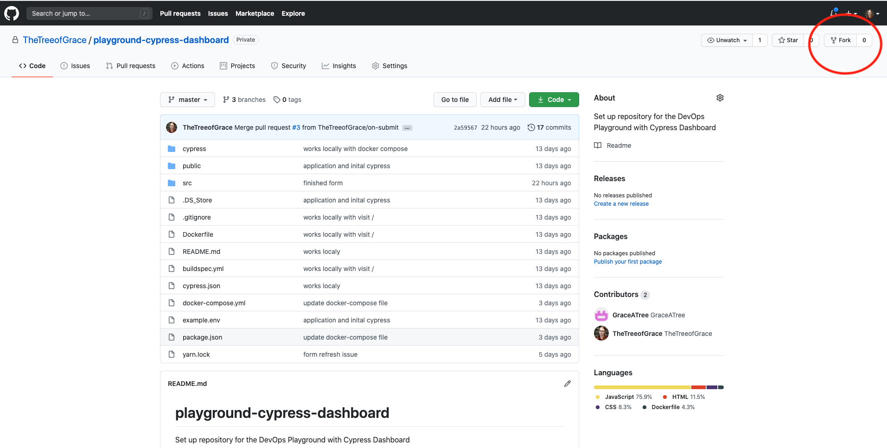
  
Once GitHub has finished copying you should now see this repository under your GitHub username with below the original repository that you Forked from.  
`<Your_UserName>/playground-cypress-dashboard`

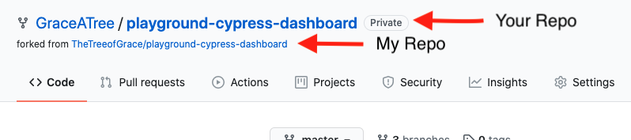

 
Now click on the big green `Code` button copy the HTTPS link of the GitHub repository. For this use `right-click -> copy`. 

 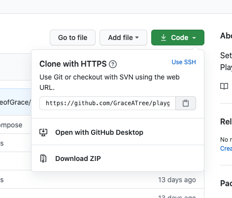

Now go to VSCode that you opened. You can do `alt+tab` to navigate between applications or select it from the top bar next to applications. 

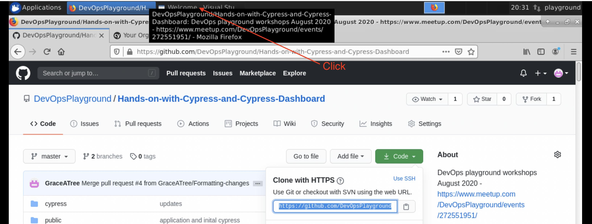

Maximise VS Code if you have not already. Click `Terminal` at the top of the screen. Or `ctrl+shift` + backtick.

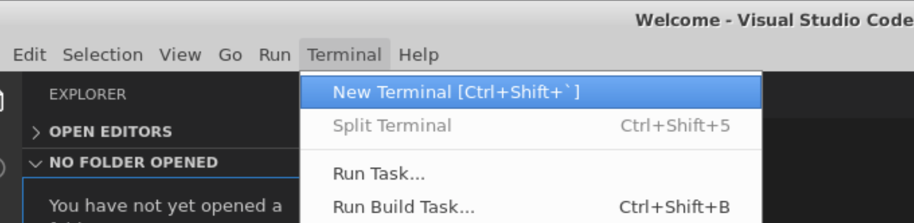

In the terminal enter the following command (right click paste your repository link): 

`git clone <link to your GitHub repo>`


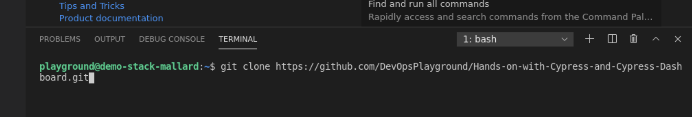

Once the clone is complete enter

`cd Hands-on-with-Cypress-and-Cypress-Dashboard`
`code .`

Here lets take a look at the package.json file. In this file is all the dependencies that will be needed to run the application along with developer dependencies such as our Cypress engine. If we take a look at the scripts object we can see commands that we can use to get started. However these commands run through our project dependencies that need to be downloaded and installed. 

Enter ‘yarn’ into the terminal.

 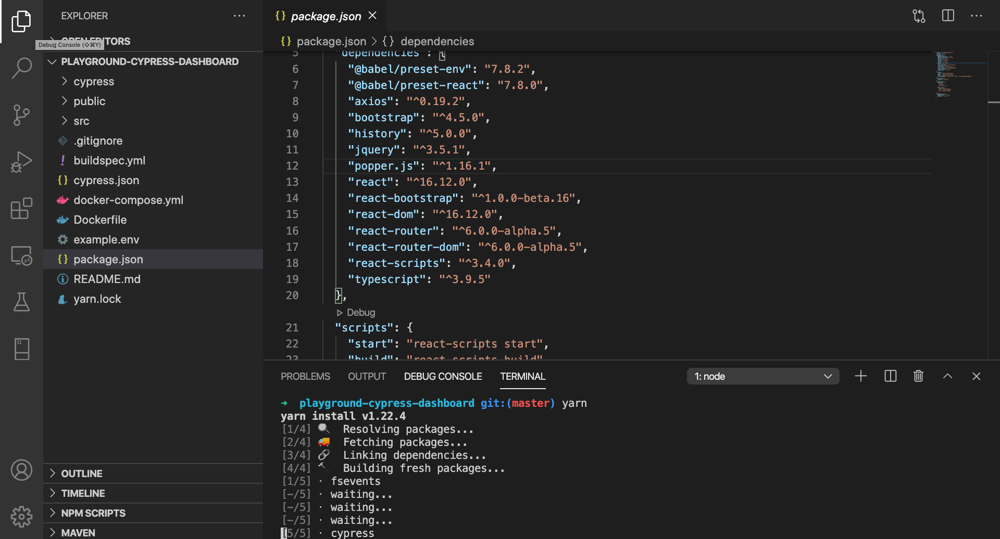

The dependencies (including cypress) are installed we can run `yarn cypress open` which will open up the Cypress UI. In the top right you will be able to log into Cypress. Do so with your GitHub account details.

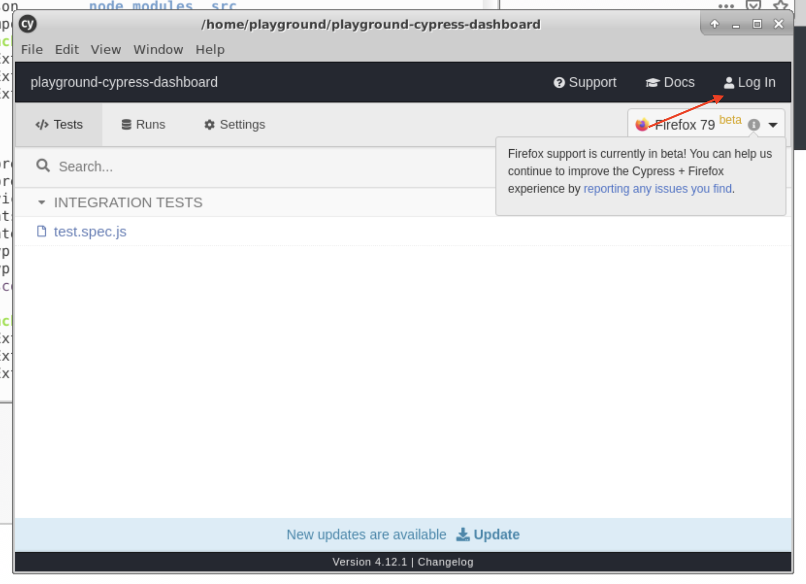

Once logged in click on ‘Runs’. Here you can create a new Cypress Dashboard project. Click `Set up a new project`.

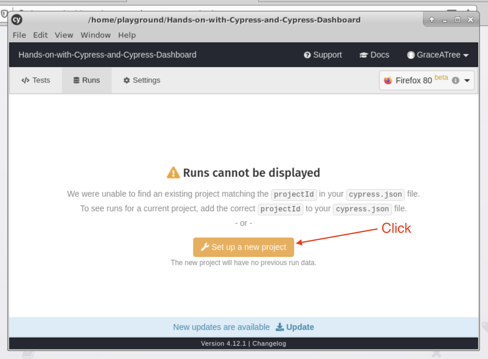

Leave all the details the same but select `Public` and then `Set up project`.

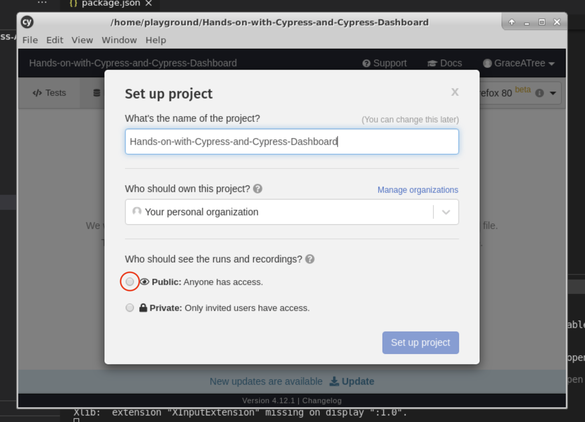

You will then be able to see your `projectId` and your record key needed to authorise your cypress test runner to record the tests to your Cypress Dashboard account. Your projectId should already be updated in your `cypress.json` file.

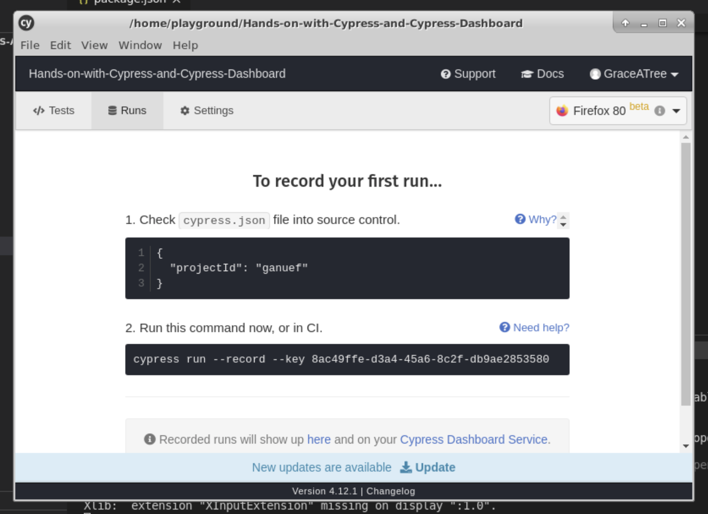

To be able to use the dashboard access key we will take a look at the `example.env` file. This file is a templates file for environment variables that your application needs. Right click and copy the `example.env` file and paste it back into the repository. Rename it to `.env`. 
Now we need to copy the record key to the right side of the assignment operator in our `.env` file. 

`CYPRESS_RECORD_KEY=<your-cypress-dashboard-key>`
e.g. `CYPRESS_RECORD_KEY= XXXXXXXX-XXXX-XXXX-XXXX-XXXXXXXXXXXX`

Now let’s test we have managed to integrate with Cypress Dashboard. We will do this by opening another terminal inside of visual studio code to run the application with `yarn start`. Once the application is running you should see this message `Compiled successfully` in the terminal.

 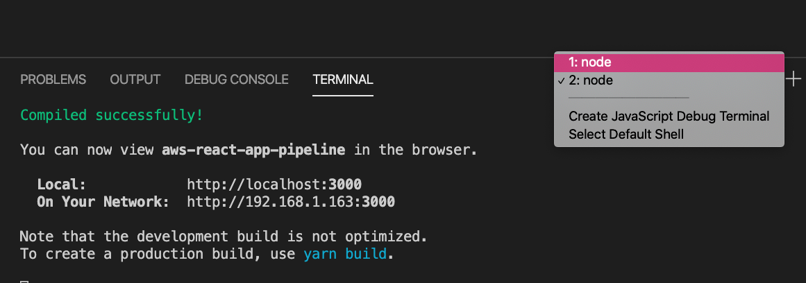

Now we need to kill cypress in the first terminal (1: node) by navigating back and doing `ctrl+c`. Or you can manually close cypress. 

Once cypress is killed we need to export our cypress key by running `export CYPRESS_RECORD_KEY=< your-cypress-dashboard-key>`. You can copy this from your .env file to save you some time. 

There is an initial test that has already been written so we can test our configuration with Cypress Dashboard. If we go to the package.json file scripts object we can see there is a command called `test-dashboard`. We will run this in our terminal with `yarn test-dashboard`. This command contains the following flags `--report` and `--key` which let cypress know we wish to record our results to Cypress dashboard along with where it can find the environment key for authentication. 

Run the command `yarn test-dashboard`.

Feel free to look through the output in the console. You will see the test run and pass along with a video being created. The most important part to take note of is the ‘Uploading Results’ section as this tells us if it was successfully uploaded to our cypress dashboard. We can now confirm this by going to our cypress dashboard account. 

Refresh the page and you will see there is now a project that has been created. Click on the `Hands-on-with-Cypress-and-Cypress-Dashboard`. 

 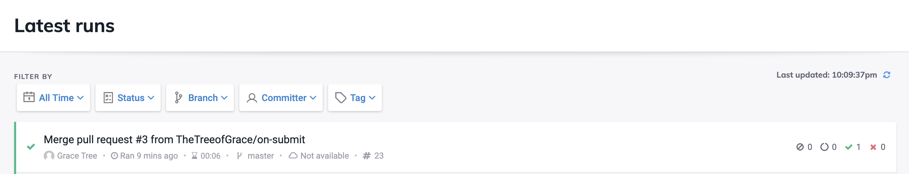

Woohoo! Congratulations you have now set up the application with cypress dashboard. But just to check it is all working well lets go ahead and edit the test file to fail. Go ahead and open ‘cypress/integration/test.spec.js’.

We can make this test fail by inverting the assert on the submit button to `not.be.visible`

`cy.get('[type="submit"]').should('not.be.visible');`

Now run the `yarn test-dashboard` command in the terminal and you should see the test fail. Once done uploading check back on Cypress Dashboard. (You may need to refresh the page). 

 
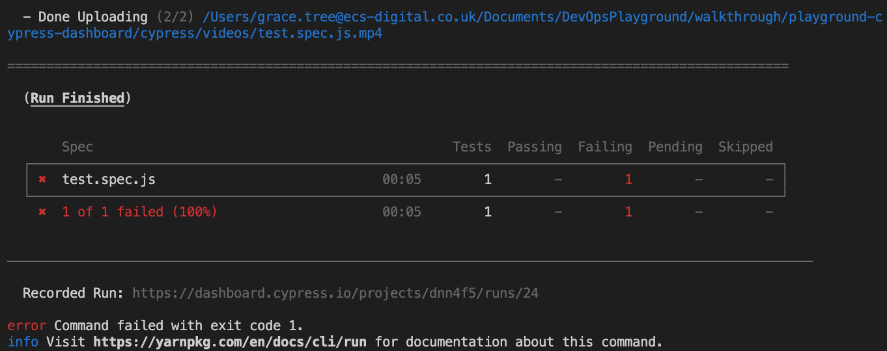

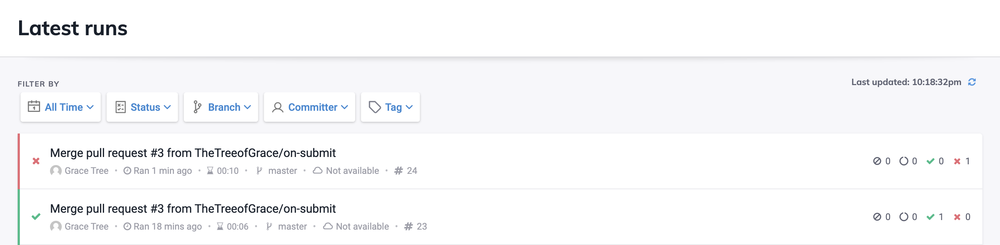
 

Awesome! Looks like it is working correctly. If you have sped ahead please take some time to familiarise yourself to Cypress Dashboard if you are new. You can click on the runs and view more details about the tests that were run and what has been recorded. This is a great way to see how easy it is to view reasons for test failures when using Cypress along with test successes. 

Before we wrap this section of Cypress Dashboard up, there is one more configuration to make. This is with adding the GitHub Webhook integration. 

In Cypress Dashboard click `View all projects` and go to ‘Integrations’ and select `Install GitHub integration`. 

 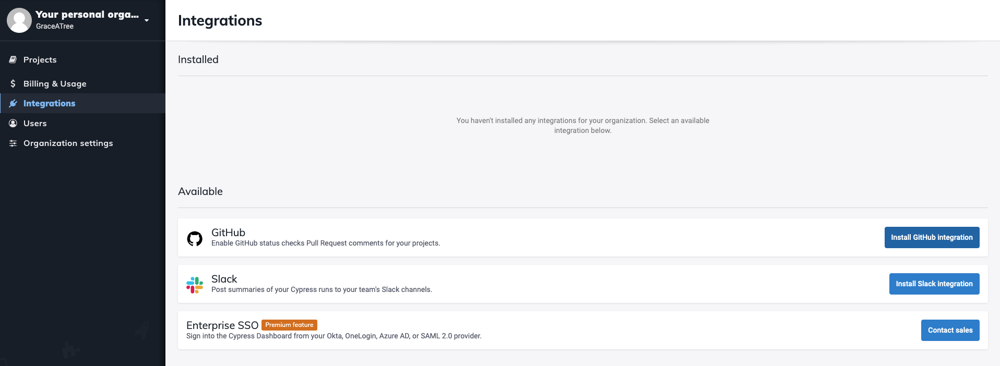
 
You will be redirected to GitHub where you chose to allow Cypress Dashboard access to all repositories in your account or you can just select this repository ‘Hands-on-with-Cypress-and-Cypress-Dashboard’ and click `Install`. 

> Note: There might be some variation of this depending on your GitHub account type and if you are part of any organisations. 

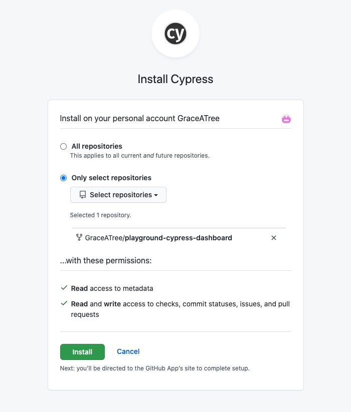

Once installed Cypress Dashboard will submit status checks for your cypress test runs on pull requests. 

> Tip: If you get a `Cannot connect to repository` error or warning then you will need to further configure Cypress Dashboard but clicking `Configure`. Then select your repository again. 

If you click on `Configure` you will need to update the `Default branch` to `develop`. 

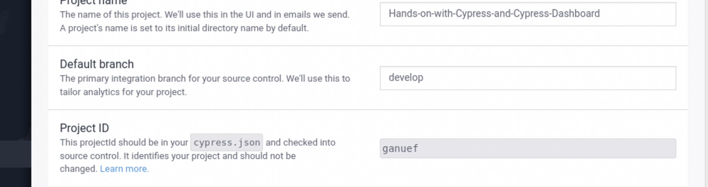

Very quickly let’s commit our changes to the `develop` branch. 

In VS Code type the following commands:

`git checkout develop`
`git add .`
`git commit -m ‘cypress dashboard setup’`
`git push`

If you get the following error like I did follow the run commands in the terminal with your GitHub details: 


Then repeat the git commit steps above again. You will then get the following pop-up.

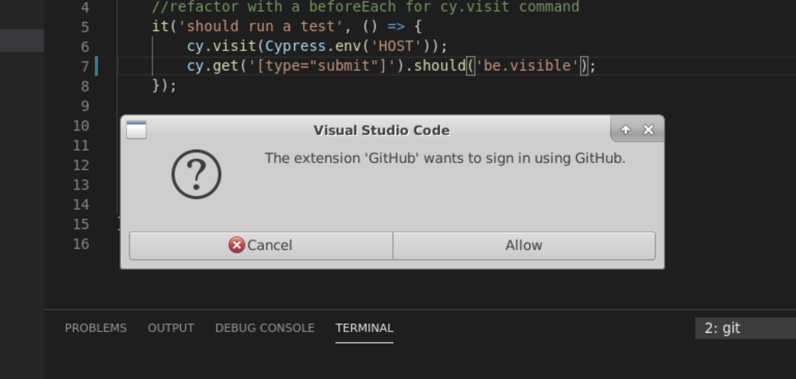

Click `Allow` which will then go through the process of authorising Visual Studio Code access to your GitHub account. It might fail the first time or hang. Try `ctrl+c` and if still not responsive refresh the instance in your local browser. 

Next we will move onto the next section with adding in CI to trigger this Cypress Integration – Automating Cypress Tests though AWS Code Build.

# Stage 2: Automating Cypress Tests in CI

Ok, so we how have Cypress Dashboard linked up to our GitHub repo. Now it is time to set up our CI pipeline in Code Build. To do so log into https://aws.amazon.com/console with either your own account or IAM user or the one that we have provided. 

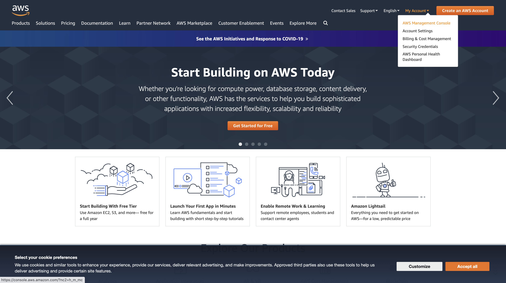

Once logged in go to code build by typing `CodeBuild` in the search bar. Then click on `Create build project`. 
 
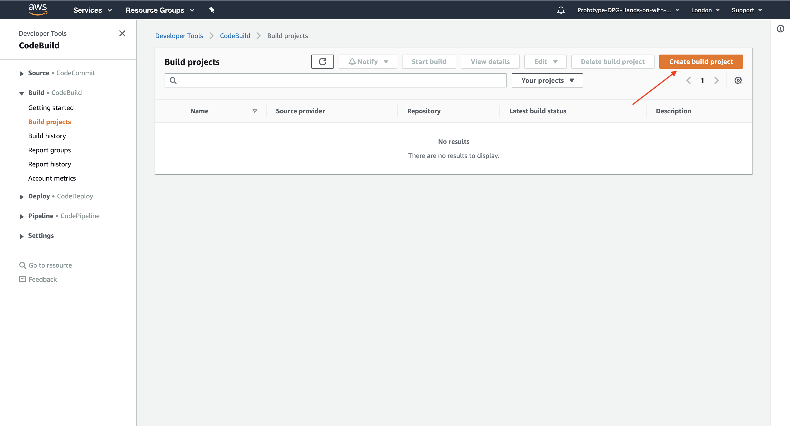

Fill out the following Details:

* Project name: ` playground-<your-animal>`
* Click `Additional configuration` and for `Key` enter `name`.
* For `Value` enter `cypress-playground`.

For `Source provider` select GitHub. If you are using our AWS account you will need your github repository to be public and copy and paste the HTTPS URL into the repository Source.

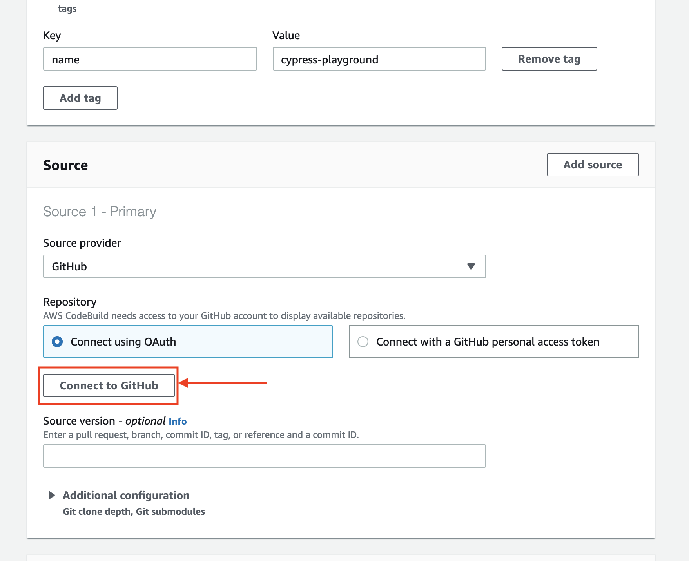


If you are using your own AWS account you will need to do the following steps (skip this if following along).

--START—

 Leave `Connect using OAuth` selected unless you wish to use a personal access token instead. Then click `Connect to GitHub`.
 
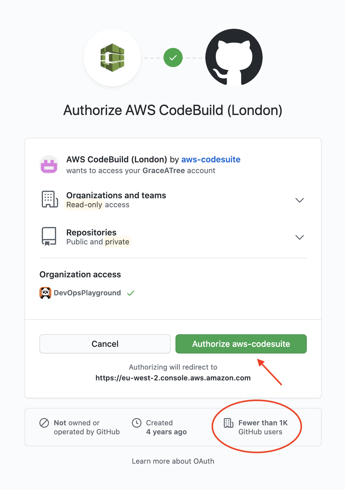

Click on `Authorize aws-codesuite` congratulations you have joined the cool club of less then 1k other people who use this integration! Once clicking you will be prompted to enter your password. Then select `Confirm`. 

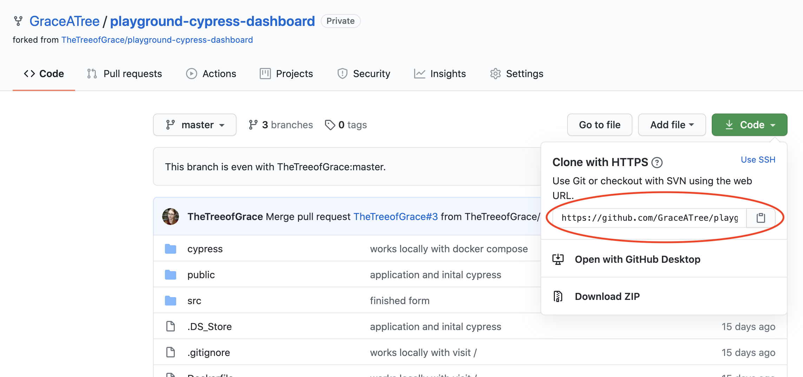

Next click on `Repository in my GitHub account` and click on the GitHub repository box and select `<your-github-username>/playground-cypress-dashboard` from the dropdown. 

Then check the `Rebuild every time a code change is pushed` box.

For event type select the following
`PULL_REQUEST_CREATED`
`PULL_REQUEST_UPDATED`
`PULL_REQUEST_REOPENED`

--END--

Now for the Environment section make sure you select the following: 

* `Managed image`
* Operating system `Ubuntu`
* Runtime(s) `Standard`
* Image `aws/codebuild/standard:4.0`
* Image version `Always use the latest image`
* Environment type `Linux`
* Privileged : checked

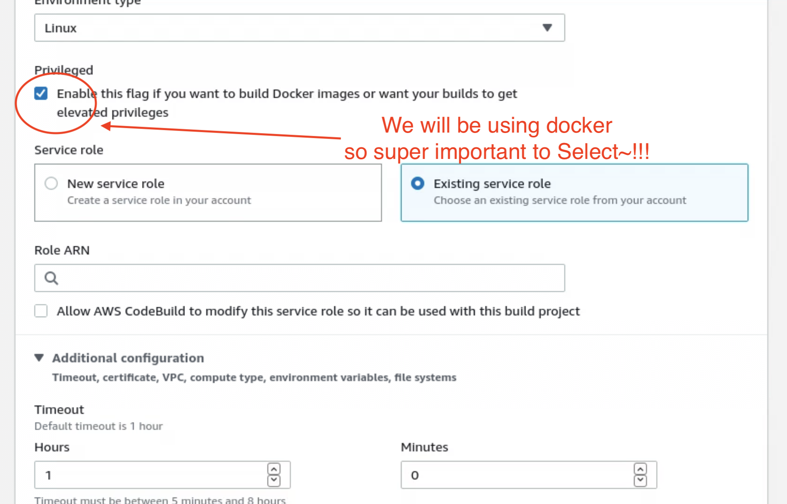

For `Service role` select `Existing service role`. Then for `Role ARN` use:  `arn:aws:iam::630895193694:role/service-role/codebuild-playground-<your-animal>-service-role`. De-select `Allow AWS CodeBuild…`

Next, click on Additional configuration and scroll down to `Environment variables`. Here is where we need to add our Cypress Dashboard access key from our .env file. 
For Name enter: `CYPRESS_RECORD_KEY` and for value enter your key. We will keep Type as `Plaintext` this time but better practice would be to use the AWS Secrets Manager. 

That is all we need to do for now as our repository contains the buildspec file. Click on `Create build project`. While that creates lets go and look at the buildspec.yml file inside VS Code. 

Here is a quick run down:
`version: 0.2` - this is the AWS recommended buildspec version
Then there are three stages with commands that we ran in the terminal when setting up our project. We also need to do this for the CI environment which will be a fresh environment every time. The command of most note here is `yarn test-ci`. We can look at this command in our `package.json`. 

Under the `scripts` object we can see this command runs ` docker-compose up --exit-code-from cypress`. Docker-compose is a way of creating a docker container system which is useful for testing our application on any environment. If you take a look at the `docker-compose.yml` file you can see the cypress image that we use as a base along with the environment variables needed by our application. It also depends on the react-app image which will be created from the `Dockerfile` if it does not already exist. 

We can now go back to AWS and create a build off our develop branch. This is because of OAuth setup. If you were using your own AWS account with OAuth you could set CodeBuild to trigger on pull requests. For now we will have to do this manually. 

Click on `Start build`.

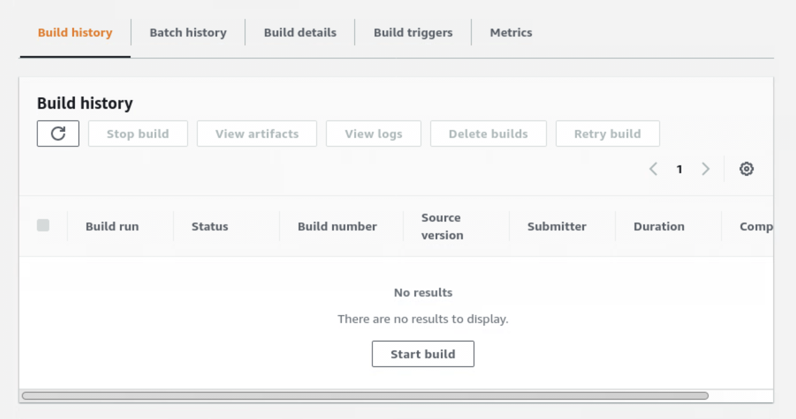

Under `Source version` type in `develop` and then click `Start build`. You should see build status in progress and you can watch the logs as the docker images and containers build. Eventually you will be able to see the tests running. 

If you were using your own AWS account you would be able to see checks pending if you made Pull Requests. For the paid version of GitHub, such as Teams or Enterprise you can make these checks required preventing merges unless CodeBuild is successful. 

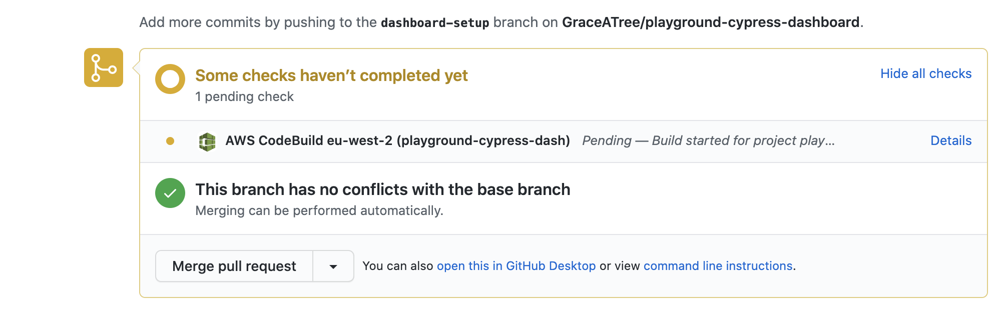


If you click back to Cypress Dashboard you will see that there is a new test run from our CodeBuild pipeline.  

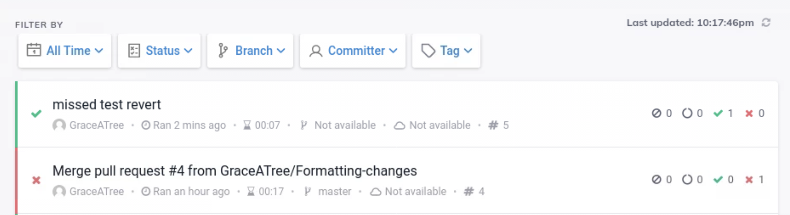

And there you have it. Now we have set up Cypress Dashboard to run locally and in our CI pipeline. Now it is time for the final stage. Getting hands on with writing some Cypress tests!

# Stage 3: Writing Cypress Tests!

Let’s get started writing some cypress tests. First lets look more closely at the test in the  `test.spec.js` file. This test visits the application that we want to test like how you type in the URL in a search bar to visit a website. The URL for the application comes from the `HOST` variable that is declared in our `cypress.json` file. We can access cypress environment variables from this file by using `Cypress.env()`. 

Before we make any changes to the code, go ahead and make a branch off develop like we did earlier and call it `cypress-tests`. 

We are going to be writing a few tests in this file and cypress will need to visit the application multiple times. To avoid code duplication for the set up we can use the beforeEach method. Enter this code under the comment like so:

```javascript
//refactor with a beforeEach for cy.visit command
  beforeEach(() => cy.visit(Cypress.env('HOST')));
```

Now remove the `cy.visit` command from the test, so it now looks like this: 

```javascript
it('should run a test', () => {
  cy.get('[type="submit"]').should('be.visible');
});
```

This is better but there is still some improvement to be made. The `cy.get` command gets elements from the dom that match the given parameter. Here we are getting the submit button with `’[type=”submit”]’`. This is acceptable but personally I prefer adding `data-qa` attributes to the elements as they are less likely to be changed and is also a way to document what parts of the application are being tested when looking through the code. 

Lets find the submit button in the application and add the `data-qa` attribute. It can be found by going to `src/components/feedback/feedback.js`. Look through the code and see if you can find where `type=”submit”` is in the code. When you have found it add the following before the `type` attribute: 

```html
data-qa=”submit-button”
```

It should now look like the following:

```html
<input data-qa="submit-button" type="submit" value="Submit"/>
```

From personal experience I have always found it best to add the `data-qa` attributes just after the element tag. This is because it makes it easier to find and makes it less likely to be accidently removed through a pull request or merge. 

Now we have added this one more thing I like to do to reduce code duplication and make it easier to update any of these data-qa values in our tests is by creating a constant file where they can be stored. 

Make a folder called `constants` in the root of the application and create a file called `feedbackConst.js`.

Enter the following code: 

```javascript
export const feedbackPage = {
    submitBtn: '[data-qa="submit-button"]',
};
```

Now we need to import the object into our `test.spec.js` file. Put this code at the top of the file like so: 

```javascript
/*globals Cypress cy*/
import { feedbackPage } from '../../constants/feedbackConst';
```

Now we can use this object in the test like this, I also updated the test description: 

```javascript
it('should have a submit button', () => {
  cy.get(feedbackPage.submitBtn).should('be.visible');
});
```

I am also going to rename the test file to `feedback.spec.js`. Now run the test from the terminal with `yarn test`. Note: make sure your application is still running in the other terminal if the test fails!

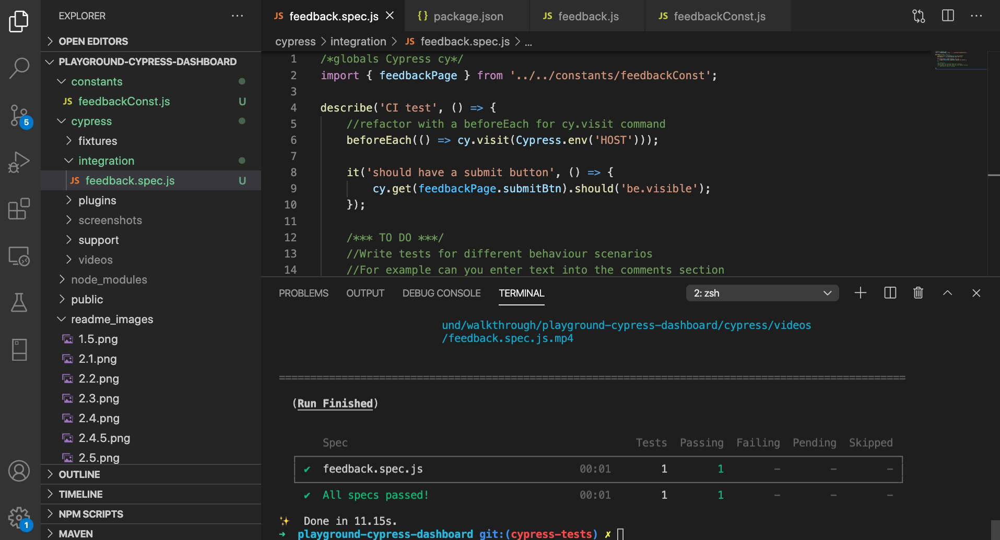 

Now try thinking of other similar tests you can write using the following:

```javascript
cy.get(<element>).click();
cy.get(<element>).should(‘something’);
```

Make sure you add your `data-qa` attributes to the elements you want to test. If you get stuck with finding an element in the code you can run the application and inspect (rightclick -> inspect) and then select the element with the selector and see when attributes are on the element to find it in the code. 

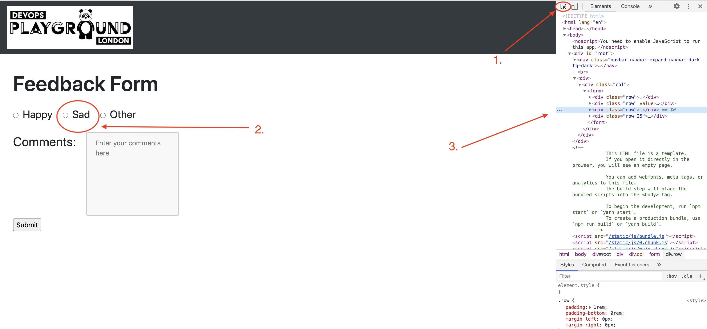

Here is an example (I will be going through more tests cases live).

```javascript
it('should select a button', () => {
  cy.get(feedbackPage.happyBtn).should('not.be.checked');
  cy.get(feedbackPage.happyBtn).click();
  cy.get(feedbackPage.happyBtn).should('be.checked');
});
```

This test checks the state of the element before acting on the element to change it. It is good to check the negative so you can be sure of the expected behaviour. 

Once you are happy with your tests run `yarn test` to check they pass before committing your changes. Then make a pull request like we did earlier from your `cypress-tests` branch to the `develop` branch. Check your `CodeBuild` pipeline is building and also check the `Cypress Dashboard` to see your tests. 

It is really useful to be able to see tests coming through on Cypress Dashboard. This way your testers and devs do not need to see the pipeline to know if the build is failing from a test. It also makes it really easy to see the reason why a test is failing and where, making any issues easier to fix or respond to. 

Congratulations you have finished! To reflect you have:
-	Set up Cypress with Cypress Dashboard
-	Linked Cypress Dashboard to your GitHub
-	Ran your Cypress Tests in an automated way through a CI pipeline using CodeBuild

Please feel free to send me a linkedIn connection request: https://www.linkedin.com/in/treeofgrace/

